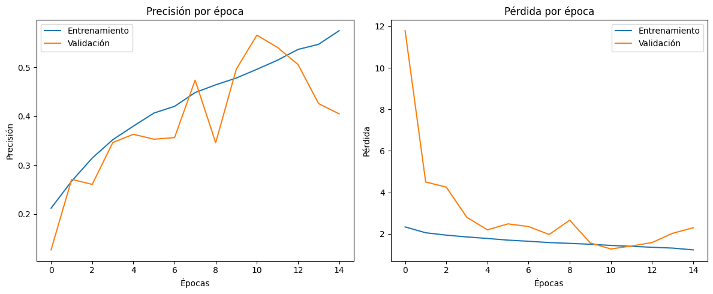
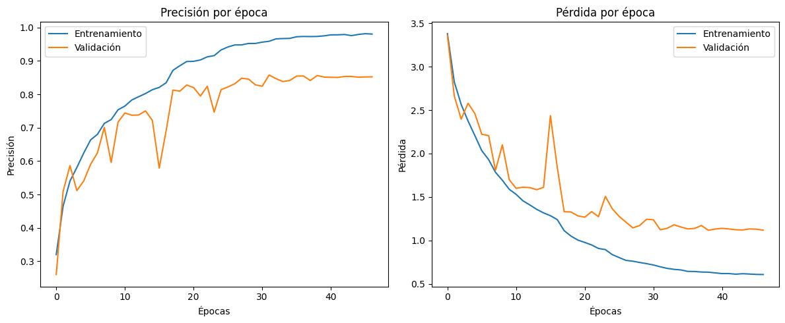
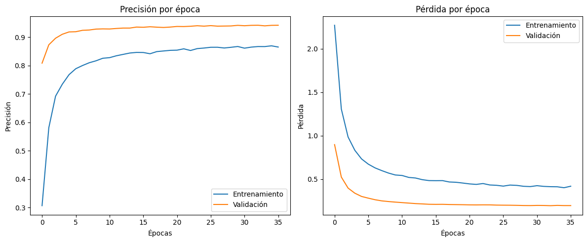
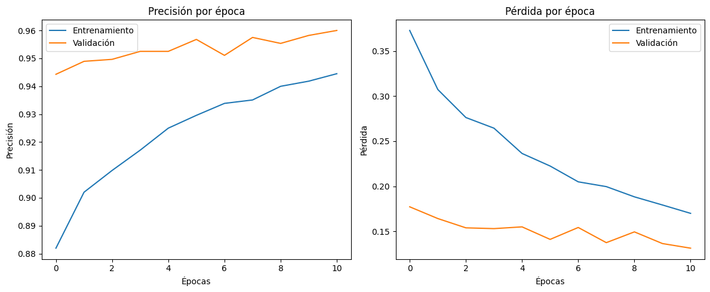
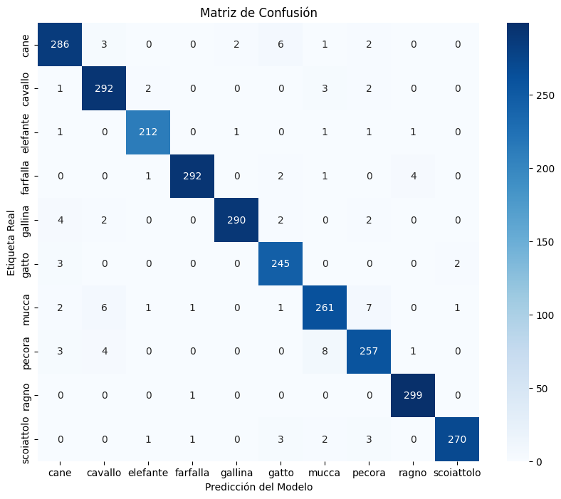

# 🤖 **Clasificador de Animales con Deep Learning: De 61% a 97% de Precisión**

Este repositorio documenta el viaje completo y metodológico para construir un clasificador de imágenes de alto rendimiento. Partiendo de un modelo básico con problemas de sobreajuste, el proyecto avanza a través de iteraciones de mejora, culminando en un modelo de vanguardia que utiliza Transfer Learning y Fine-Tuning para alcanzar una precisión del 97.39% en la clasificación de 10 tipos de animales.

# 🚀 **Resumen del Proyecto**

El objetivo es simple: clasificar imágenes de animales. Sin embargo, el camino para lograrlo implicó un proceso iterativo de diagnóstico, hipótesis y experimentación.

Este proyecto demuestra:
- La construcción de **Redes Neuronales Convolucionales (CNNs)** desde cero.

- El diagnóstico y la solución de problemas comunes como el **sobreajuste (overfitting)** y la inestabilidad del entrenamiento.

- La aplicación de un arsenal de **técnicas de regularización** (Dropout, BatchNormalization, L2, GlobalAveragePooling2D).

- La implementación experta de **Transfer Learning** con **MobileNetV2**.

- La optimización final usando **Fine-Tuning** para exprimir el máximo rendimiento.

## 1️⃣ **Modelo 1: Un Comienzo Humilde (Precisión ~54%)**

El primer intento fue una CNN secuencial estándar. Aunque aprendió patrones básicos, los resultados revelaron problemas críticos.

- **Diagnóstico**: Un severo sobreajuste (gran brecha entre la precisión de entrenamiento y la de validación) y una alta inestabilidad (curvas de validación ruidosas y con picos).

- **Aprendizaje Clave**: Un modelo sin una fuerte regularización tiende a memorizar los datos de entrenamiento en lugar de generalizar.

## 2️⃣ **Modelo 2: Domesticando el Overfitting (Precisión ~86%)**
Armado con el diagnóstico anterior, este modelo fue diseñado para ser más robusto y generalizar mejor.

**Mejoras Estratégicas:** 
    - GlobalAveragePooling2D para reemplazar la capa Flatten, reduciendo drásticamente los parámetros.

    - Regularización L2 en las capas convolucionales para penalizar la complejidad del modelo.

    - BatchNormalization para estabilizar y acelerar el entrenamiento.

    - Arquitectura de la red más profunda para que pueda aprender mayores caracteristicas.

**Resultado**: Un salto masivo en rendimiento y estabilidad. El sobreajuste se controló significativamente.

## 3️⃣ **Modelo 3: Alcanzando la Excelencia con Transfer Learning (Precisión Final 96.29%)**
Para superar el techo del 86%, introduje la idea de utilizar: Transfer Learning.

- **Fase 1:** Extractor de Características (Precisión ~94%)
Se utilizó MobileNetV2 pre-entrenado en ImageNet con sus capas congeladas.
Solo se entrenó una nueva "cabeza" clasificadora. El resultado fue una convergencia explosiva y un rendimiento excelente.

- **Fase 2:** Fine-Tuning (Precisión Final 96.29%)

Se "descongelaron" las capas superiores de MobileNetV2.
Se continuó el entrenamiento con una tasa de aprendizaje de (1e-5) para ajustar sutilmente el modelo a nuestro dataset específico.
Esta fase final pulió el modelo, mejorando el rendimiento en todas las clases y alcanzando un estado de vanguardia.

# 📊 **Resultados Finales**
El modelo final, después del fine-tuning, fue evaluado en un conjunto de prueba independiente, con los siguientes resultados:

**Precisión Global: 96.29%**

# **🛠️ Stack Tecnológico**

**Lenguaje:** Python 3
**Librerías Principales:** TensorFlow, Keras, Scikit-learn, NumPy, Pandas, Matplotlib